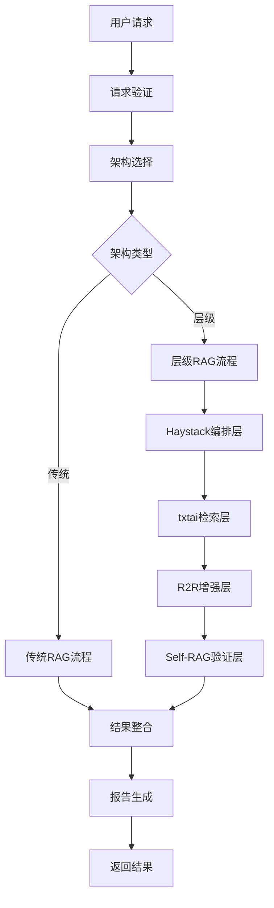

# 架构设计文档

## 概述

本文档详细介绍AuditLuma 2.0的层级RAG架构设计理念、技术选型和实现细节。

## 设计理念

### 1. 分层架构原则

AuditLuma采用分层架构设计，每一层专注于特定的功能：

```
应用层 (Application Layer)
├─ 用户接口 (CLI/API)
├─ 配置管理 (Configuration Management)
└─ 报告生成 (Report Generation)

业务层 (Business Layer)
├─ 工作流编排 (Workflow Orchestration)
├─ 任务分解 (Task Decomposition)
└─ 结果整合 (Result Integration)

RAG层 (RAG Layer)
├─ 第一层：Haystack编排层
├─ 第二层：txtai知识检索层
├─ 第三层：R2R上下文增强层
└─ 第四层：Self-RAG验证层

基础设施层 (Infrastructure Layer)
├─ 缓存系统 (Caching System)
├─ 监控系统 (Monitoring System)
└─ 配置管理 (Configuration Management)
```

### 2. 核心设计原则

#### 可扩展性 (Scalability)
- **水平扩展**：支持多实例部署和负载均衡
- **垂直扩展**：支持增加计算资源提升性能
- **模块化设计**：各层可独立扩展和优化

#### 可靠性 (Reliability)
- **故障隔离**：单层故障不影响其他层
- **自动回退**：AI组件不可用时自动切换到传统方案
- **健康检查**：实时监控各组件健康状态

#### 可维护性 (Maintainability)
- **松耦合**：各层之间通过标准接口通信
- **配置驱动**：通过配置文件控制行为
- **可观测性**：完整的日志、监控和调试支持

## 层级RAG架构详解

### 第一层：Haystack编排层

#### 设计目标
- 智能任务分解和调度
- 动态资源分配
- 结果智能整合

#### 技术架构
```python
class HaystackOrchestrator:
    """Haystack编排器基类"""
    
    def __init__(self, config: HaystackConfig):
        self.config = config
        self.task_decomposer = TaskDecomposer()
        self.parallel_executor = ParallelExecutor()
        self.result_integrator = ResultIntegrator()
    
    async def orchestrate(self, analysis_request: AnalysisRequest) -> AnalysisResult:
        # 任务分解
        tasks = await self.task_decomposer.decompose(analysis_request)
        
        # 并行执行
        results = await self.parallel_executor.execute_parallel(tasks)
        
        # 结果整合
        return await self.result_integrator.integrate(results)
```

#### Haystack-AI编排器
```python
class HaystackAIOrchestrator(HaystackOrchestrator):
    """基于AI的智能编排器"""
    
    def __init__(self, config: HaystackConfig):
        super().__init__(config)
        self.ai_planner = AITaskPlanner(config.ai_model)
        self.adaptive_scheduler = AdaptiveScheduler()
    
    async def decompose_tasks_ai(self, request: AnalysisRequest) -> List[Task]:
        """使用AI进行智能任务分解"""
        context = self._build_context(request)
        plan = await self.ai_planner.generate_plan(context)
        return self._convert_plan_to_tasks(plan)
    
    async def optimize_execution(self, tasks: List[Task]) -> ExecutionPlan:
        """AI驱动的执行优化"""
        return await self.adaptive_scheduler.optimize(tasks)
```

#### 传统编排器
```python
class TraditionalOrchestrator(HaystackOrchestrator):
    """基于规则的传统编排器"""
    
    def __init__(self, config: HaystackConfig):
        super().__init__(config)
        self.rule_engine = RuleEngine(config.rules)
    
    async def decompose_tasks_rule(self, request: AnalysisRequest) -> List[Task]:
        """基于规则的任务分解"""
        return self.rule_engine.apply_decomposition_rules(request)
```

### 第二层：txtai知识检索层

#### 设计目标
- 语义检索和相似性匹配
- 知识图谱构建和查询
- 上下文理解和扩展

#### 技术架构
```python
class TxtaiRetriever:
    """txtai知识检索器"""
    
    def __init__(self, config: TxtaiConfig):
        self.config = config
        self.index = self._build_index()
        self.embeddings = self._load_embeddings()
    
    def _build_index(self) -> Index:
        """构建向量索引"""
        return Index({
            "path": self.config.embedding_model,
            "content": True,
            "objects": True,
            "functions": [
                {"name": "similarity", "function": "similarity"},
                {"name": "context", "function": "context"}
            ]
        })
    
    async def retrieve(self, query: str, limit: int = 10) -> List[Document]:
        """语义检索"""
        results = self.index.search(query, limit)
        return [self._convert_to_document(r) for r in results]
    
    async def build_knowledge_graph(self, documents: List[Document]) -> KnowledgeGraph:
        """构建知识图谱"""
        graph = KnowledgeGraph()
        
        for doc in documents:
            entities = await self._extract_entities(doc)
            relations = await self._extract_relations(doc, entities)
            graph.add_entities(entities)
            graph.add_relations(relations)
        
        return graph
```

### 第三层：R2R上下文增强层

#### 设计目标
- 动态上下文扩展
- 关联分析和依赖追踪
- 上下文质量优化

#### 技术架构
```python
class R2REnhancer:
    """R2R上下文增强器"""
    
    def __init__(self, config: R2RConfig):
        self.config = config
        self.context_expander = ContextExpander()
        self.dependency_tracker = DependencyTracker()
        self.relevance_scorer = RelevanceScorer()
    
    async def enhance_context(self, 
                            initial_context: Context, 
                            query: str) -> EnhancedContext:
        """上下文增强"""
        
        # 第一轮扩展
        expanded_context = await self.context_expander.expand(
            initial_context, 
            expansion_depth=self.config.expansion_depth
        )
        
        # 依赖关系追踪
        dependencies = await self.dependency_tracker.track_dependencies(
            expanded_context
        )
        
        # 相关性评分和过滤
        scored_context = await self.relevance_scorer.score_and_filter(
            expanded_context, 
            query,
            threshold=self.config.relevance_threshold
        )
        
        return EnhancedContext(
            context=scored_context,
            dependencies=dependencies,
            metadata=self._build_metadata(scored_context)
        )
```

### 第四层：Self-RAG验证层

#### 设计目标
- 多模型交叉验证
- 假阳性过滤
- 置信度评估和质量保证

#### 技术架构
```python
class SelfRAGValidator:
    """Self-RAG验证器"""
    
    def __init__(self, config: SelfRAGConfig):
        self.config = config
        self.validation_models = self._load_validation_models()
        self.consensus_engine = ConsensusEngine()
        self.quality_assessor = QualityAssessor()
        self.false_positive_filter = FalsePositiveFilter()
    
    async def validate(self, 
                      analysis_result: AnalysisResult) -> ValidatedResult:
        """多模型交叉验证"""
        
        # 并行验证
        validation_tasks = [
            self._validate_with_model(model, analysis_result)
            for model in self.validation_models
        ]
        
        validation_results = await asyncio.gather(*validation_tasks)
        
        # 共识计算
        consensus = await self.consensus_engine.compute_consensus(
            validation_results,
            min_consensus=self.config.min_consensus
        )
        
        # 质量评估
        quality_score = await self.quality_assessor.assess_quality(
            analysis_result,
            consensus
        )
        
        # 假阳性过滤
        filtered_result = await self.false_positive_filter.filter(
            analysis_result,
            consensus,
            quality_score
        )
        
        return ValidatedResult(
            result=filtered_result,
            consensus=consensus,
            quality_score=quality_score,
            confidence=self._calculate_confidence(consensus, quality_score)
        )
```

## 核心组件设计

### 1. 统一编排器接口

```python
class UnifiedOrchestrator:
    """统一编排器接口"""
    
    def __init__(self, config: Config):
        self.config = config
        self.architecture_mode = self._determine_architecture_mode()
        self.orchestrator = self._create_orchestrator()
    
    def _determine_architecture_mode(self) -> ArchitectureMode:
        """确定架构模式"""
        if self.config.architecture_mode == "auto":
            return self._auto_select_architecture()
        return ArchitectureMode(self.config.architecture_mode)
    
    def _create_orchestrator(self) -> BaseOrchestrator:
        """创建编排器实例"""
        if self.architecture_mode == ArchitectureMode.HIERARCHICAL:
            return self._create_hierarchical_orchestrator()
        else:
            return self._create_traditional_orchestrator()
    
    async def analyze(self, request: AnalysisRequest) -> AnalysisResult:
        """统一分析接口"""
        return await self.orchestrator.analyze(request)
```

### 2. 缓存系统设计

```python
class HierarchicalCache:
    """层级缓存系统"""
    
    def __init__(self, config: CacheConfig):
        self.config = config
        self.layers = self._initialize_cache_layers()
        self.strategy = CacheStrategy(config.strategy)
    
    def _initialize_cache_layers(self) -> Dict[str, CacheLayer]:
        """初始化缓存层"""
        layers = {}
        
        for layer_name, layer_config in self.config.layer_cache.items():
            if layer_config.enabled:
                layers[layer_name] = CacheLayer(
                    name=layer_name,
                    ttl=layer_config.ttl,
                    backend=self._create_cache_backend(layer_config)
                )
        
        return layers
    
    async def get(self, layer: str, key: str) -> Optional[Any]:
        """获取缓存"""
        if layer not in self.layers:
            return None
        
        cache_layer = self.layers[layer]
        return await cache_layer.get(key)
    
    async def set(self, layer: str, key: str, value: Any) -> None:
        """设置缓存"""
        if layer not in self.layers:
            return
        
        cache_layer = self.layers[layer]
        await cache_layer.set(key, value)
```

### 3. 监控系统设计

```python
class MonitoringSystem:
    """监控系统"""
    
    def __init__(self, config: MonitoringConfig):
        self.config = config
        self.metrics_collector = MetricsCollector()
        self.health_checker = HealthChecker()
        self.alert_manager = AlertManager()
    
    async def start_monitoring(self):
        """启动监控"""
        # 启动指标收集
        await self.metrics_collector.start()
        
        # 启动健康检查
        await self.health_checker.start()
        
        # 启动告警管理
        await self.alert_manager.start()
    
    async def collect_metrics(self) -> Dict[str, Any]:
        """收集指标"""
        return {
            "performance": await self._collect_performance_metrics(),
            "business": await self._collect_business_metrics(),
            "system": await self._collect_system_metrics()
        }
```

## 数据流设计

### 1. 分析请求流程



### 2. 数据模型设计

```python
@dataclass
class AnalysisRequest:
    """分析请求数据模型"""
    project_path: str
    output_path: str
    config: AnalysisConfig
    filters: Optional[List[str]] = None
    metadata: Optional[Dict[str, Any]] = None

@dataclass
class AnalysisResult:
    """分析结果数据模型"""
    vulnerabilities: List[Vulnerability]
    statistics: AnalysisStatistics
    recommendations: List[Recommendation]
    metadata: ResultMetadata
    
@dataclass
class Vulnerability:
    """漏洞数据模型"""
    id: str
    type: VulnerabilityType
    severity: Severity
    description: str
    location: CodeLocation
    confidence: float
    remediation: Optional[Remediation] = None

@dataclass
class ValidatedResult:
    """验证后的结果数据模型"""
    result: AnalysisResult
    consensus: ConsensusResult
    quality_score: float
    confidence: float
    validation_metadata: ValidationMetadata
```

## 配置系统设计

### 1. 配置层次结构

```yaml
# 配置层次结构
config/
├── config.yaml                 # 主配置文件
├── environments/
│   ├── development.yaml        # 开发环境配置
│   ├── staging.yaml           # 测试环境配置
│   └── production.yaml        # 生产环境配置
├── models/
│   ├── openai.yaml            # OpenAI模型配置
│   ├── deepseek.yaml          # DeepSeek模型配置
│   └── custom.yaml            # 自定义模型配置
└── schemas/
    ├── config.schema.json     # 配置文件JSON Schema
    └── validation.py          # 配置验证逻辑
```

### 2. 配置管理器

```python
class ConfigManager:
    """配置管理器"""
    
    def __init__(self, config_path: str):
        self.config_path = config_path
        self.config = self._load_config()
        self.validator = ConfigValidator()
    
    def _load_config(self) -> Config:
        """加载配置"""
        base_config = self._load_base_config()
        env_config = self._load_environment_config()
        return self._merge_configs(base_config, env_config)
    
    def validate(self) -> ValidationResult:
        """验证配置"""
        return self.validator.validate(self.config)
    
    def reload(self) -> None:
        """重新加载配置"""
        self.config = self._load_config()
        
    def get_hierarchical_rag_config(self) -> HierarchicalRAGConfig:
        """获取层级RAG配置"""
        return self.config.hierarchical_rag_models
```

## 扩展性设计

### 1. 插件系统

```python
class PluginManager:
    """插件管理器"""
    
    def __init__(self):
        self.plugins = {}
        self.hooks = defaultdict(list)
    
    def register_plugin(self, plugin: Plugin) -> None:
        """注册插件"""
        self.plugins[plugin.name] = plugin
        
        # 注册钩子
        for hook_name, handler in plugin.hooks.items():
            self.hooks[hook_name].append(handler)
    
    async def execute_hook(self, hook_name: str, *args, **kwargs) -> List[Any]:
        """执行钩子"""
        results = []
        for handler in self.hooks[hook_name]:
            result = await handler(*args, **kwargs)
            results.append(result)
        return results

class Plugin:
    """插件基类"""
    
    def __init__(self, name: str):
        self.name = name
        self.hooks = {}
    
    def register_hook(self, hook_name: str, handler: Callable) -> None:
        """注册钩子处理器"""
        self.hooks[hook_name] = handler
```

### 2. 自定义分析器

```python
class CustomAnalyzer:
    """自定义分析器基类"""
    
    def __init__(self, config: AnalyzerConfig):
        self.config = config
    
    async def analyze(self, code: str, context: AnalysisContext) -> AnalysisResult:
        """分析方法，子类需要实现"""
        raise NotImplementedError
    
    def get_supported_languages(self) -> List[str]:
        """获取支持的编程语言"""
        raise NotImplementedError

class SecurityAnalyzer(CustomAnalyzer):
    """安全分析器示例"""
    
    async def analyze(self, code: str, context: AnalysisContext) -> AnalysisResult:
        # 实现具体的安全分析逻辑
        vulnerabilities = await self._detect_vulnerabilities(code)
        return AnalysisResult(vulnerabilities=vulnerabilities)
```

## 性能优化设计

### 1. 异步处理架构

```python
class AsyncProcessor:
    """异步处理器"""
    
    def __init__(self, max_workers: int = 10):
        self.max_workers = max_workers
        self.semaphore = asyncio.Semaphore(max_workers)
        self.executor = ThreadPoolExecutor(max_workers=max_workers)
    
    async def process_batch(self, items: List[Any], 
                          processor: Callable) -> List[Any]:
        """批量异步处理"""
        async def process_item(item):
            async with self.semaphore:
                return await processor(item)
        
        tasks = [process_item(item) for item in items]
        return await asyncio.gather(*tasks)
```

### 2. 内存管理

```python
class MemoryManager:
    """内存管理器"""
    
    def __init__(self, max_memory_mb: int = 1024):
        self.max_memory_mb = max_memory_mb
        self.current_memory = 0
        self.memory_pool = {}
    
    def allocate(self, key: str, size_mb: int) -> bool:
        """分配内存"""
        if self.current_memory + size_mb > self.max_memory_mb:
            self._cleanup_memory()
            
        if self.current_memory + size_mb <= self.max_memory_mb:
            self.memory_pool[key] = size_mb
            self.current_memory += size_mb
            return True
        
        return False
    
    def _cleanup_memory(self) -> None:
        """清理内存"""
        # 实现LRU清理策略
        pass
```

## 安全设计

### 1. 数据安全

```python
class DataSecurity:
    """数据安全管理"""
    
    def __init__(self, config: SecurityConfig):
        self.config = config
        self.encryptor = DataEncryptor(config.encryption_key)
        self.sanitizer = DataSanitizer()
    
    def encrypt_sensitive_data(self, data: Dict[str, Any]) -> Dict[str, Any]:
        """加密敏感数据"""
        encrypted_data = {}
        
        for key, value in data.items():
            if self._is_sensitive_field(key):
                encrypted_data[key] = self.encryptor.encrypt(value)
            else:
                encrypted_data[key] = value
        
        return encrypted_data
    
    def sanitize_logs(self, log_data: str) -> str:
        """清理日志中的敏感信息"""
        return self.sanitizer.sanitize(log_data)
```

### 2. API安全

```python
class APISecurityManager:
    """API安全管理器"""
    
    def __init__(self, config: APISecurityConfig):
        self.config = config
        self.rate_limiter = RateLimiter()
        self.auth_manager = AuthenticationManager()
    
    async def validate_request(self, request: Request) -> ValidationResult:
        """验证API请求"""
        # 身份验证
        auth_result = await self.auth_manager.authenticate(request)
        if not auth_result.is_valid:
            return ValidationResult(valid=False, reason="Authentication failed")
        
        # 速率限制
        rate_limit_result = await self.rate_limiter.check_limit(request)
        if not rate_limit_result.allowed:
            return ValidationResult(valid=False, reason="Rate limit exceeded")
        
        return ValidationResult(valid=True)
```

## 总结

AuditLuma 2.0的层级RAG架构设计遵循以下核心原则：

1. **分层解耦**：每层专注特定功能，层间通过标准接口通信
2. **智能编排**：AI驱动的任务分解和执行优化
3. **多重验证**：多模型交叉验证确保结果准确性
4. **高可用性**：自动回退和故障隔离机制
5. **可扩展性**：插件系统和自定义分析器支持
6. **性能优化**：异步处理、缓存和内存管理
7. **安全保障**：数据加密和API安全管理

这种设计使得AuditLuma能够在保持高性能的同时，提供准确、可靠的代码安全审计服务。